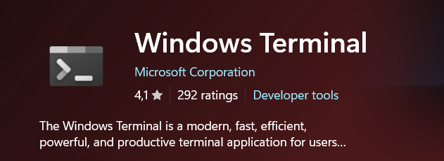
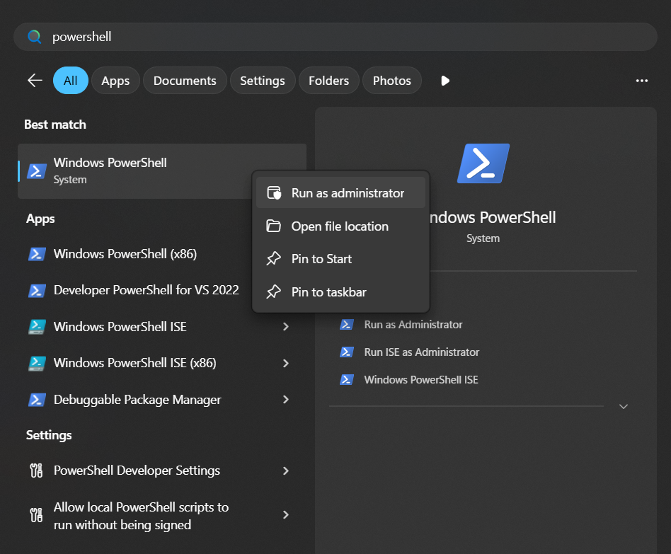
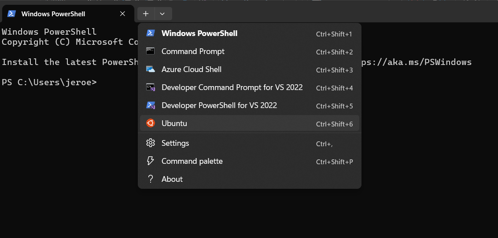
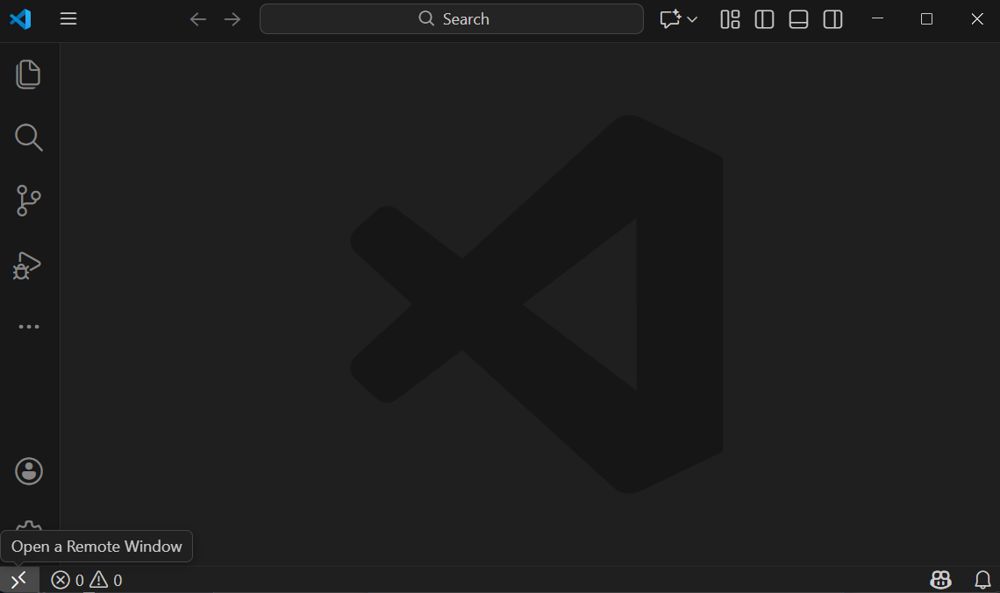
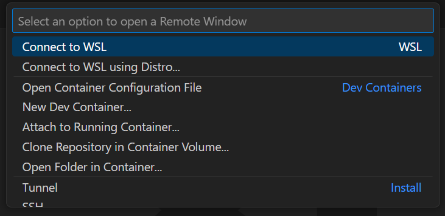
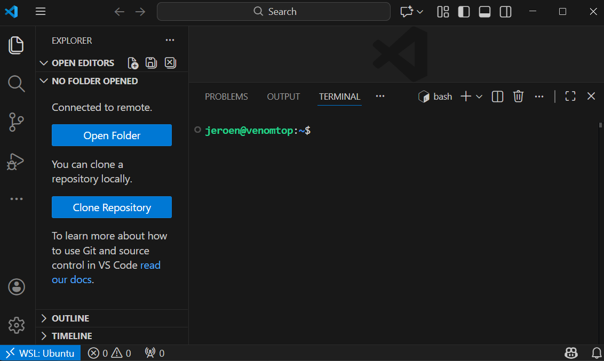
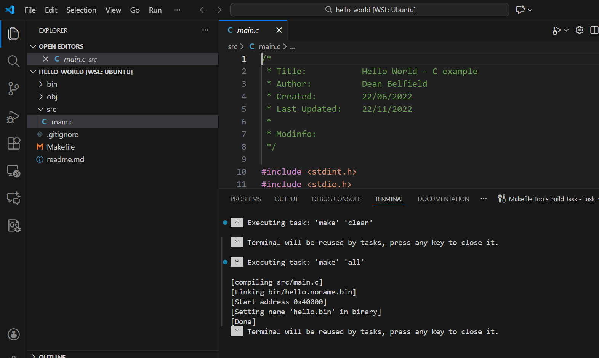

# Windows (WSL) Installation

At this moment, the Agondev is supported under Windows Subsystem for Linux. This is a Windows feature that allows you to run a full Linux environment directly on Windows, providing excellent compatibility with Linux applications through a real Linux kernel.

A WSL user has access to the Windows C drive through /mnt/c. Vice-versa, WSL environment is accessible from the Windows side using \\\\wsl.localhost\Ubuntu (if a Ubuntu distribution is used).
This means that both environments have bidirectional access to each other's filesystem, bridging both world for the user.

Specific tools such as Visual Studio Code, allow 'remote' access and actions to the WSL side, allowing users to develop and build programs from their native Windows GUI.

This installation guide gives the required steps to get to a working environment using WSL2 and the default Ubuntu installation it brings.

## 1 - Install Windows Terminal
Install the latest Windows Terminal from the Microsoft Store app, which automatically sets up a terminal profile for each WSL Linux distribution that it finds. This allows great access to the Linux environment using the native bash shell in a Windows terminal.



## 2 - Install WSL
Open a powershell terminal as Administrator to install wsl



Install WSL using
```
wsl --install
```

This sets up a default Ubuntu image. For additional installation details and other options, please see [https://learn.microsoft.com/en-us/windows/wsl/install](https://learn.microsoft.com/en-us/windows/wsl/install)

## 3 - Open a Windows terminal to WSL Ubuntu
Start Windows terminal, which will likely start with a Powershell terminal by default, and activate a second Ubuntu terminal profile using the '+' sign



## 4 - Set up Agondev using the Linux guide
Please follow the full [Linux installation guide](./install-linux.md) and return here when finished.

## 5 - Install Visual Studio Code
Download and install from [https://code.visualstudio.com/Download](https://code.visualstudio.com/Download)

## 6 - Open a 'remote' WSL connection
Open Visual Studio Code and select a 'remote' WSL connection in the bottom-left corner





Visual Studio Code now allows you to open your remote project folder. You are working remotely in the WSL/Ubuntu space:



## 7 - Install Visual Studio Code support packages
These packages allow easy (remote) compilation and building. Select the packages icon on the left, and install at least the 'C/C++' and 'Makefile Tools' from Microsoft.

## 8 - Build a project
Open one of the example projects, type SHIFT-CTRL-p to open the Command Palette, and select 'Makefile: Clean and build the target ALL'. This makes the entire project



You can either go to the WSL bash in Windows Terminal to copy the resulting .bin file to your Agon, or open a bash terminal from within Visual Studio Code - open the Command Palette and select 'Create New Terminal (With Profile)' and select 'bash'; your remote WSL bash terminal opens in Visual Studio Code.

Visual Studio Code allows automation and scripting, so you'll be able to automate the copying of your project's binaries as you wish.
For additional details see [https://code.visualstudio.com/docs/remote/wsl](https://code.visualstudio.com/docs/remote/wsl)